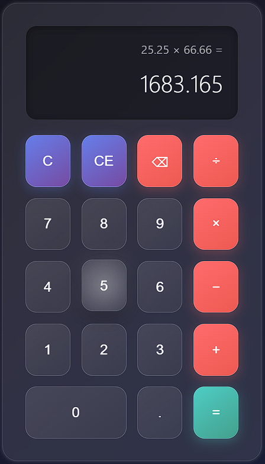

#  🧮  Modern Glowing Calculator

A stylish calculator built using **HTML5**, **CSS3**, and **JavaScript**.  
It features a modern glowing design with smooth user interaction and supports basic arithmetic operations.

---

## 🚀 Features
- Modern glowing UI with smooth effects
- Basic arithmetic operations (+, −, ×, ÷)
- Responsive and lightweight
- Built with pure HTML, CSS, and JavaScript (no external libraries)

---

## 📸 Screenshots



---

## 🛠️ Tech Stack
- **HTML5** → Structure of the calculator  
- **CSS3** → Styling and glowing effects  
- **JavaScript** → Calculator functionality  

---
### Effects
- Backdrop blur for glassmorphism
- Box shadows for depth
- Hover animations with glow
- Smooth transitions
- Ripple effect on click
---

## 📂 Project Structure

```
modern-glowing-calculator/
│
├── index.html          # Main HTML structure
├── styles.css          # Styling and animations
├── script.js           # Calculator logic
├── README.md           # Documentation
├── LICENSE             # MIT License
└── .gitignore          # Git ignore rules
```
---

## 👨‍💻 Author

**Aamir Neyazi**

- GitHub: [@AamirNeyazi2499](https://github.com/AamirNeyazi2499)
- LinkedIn: [Aamir Neyazi](https://www.linkedin.com/in/aamirneyazi/)

---

<div align="center">

Made with ❤️ by Aamir Neyazi

</div>
